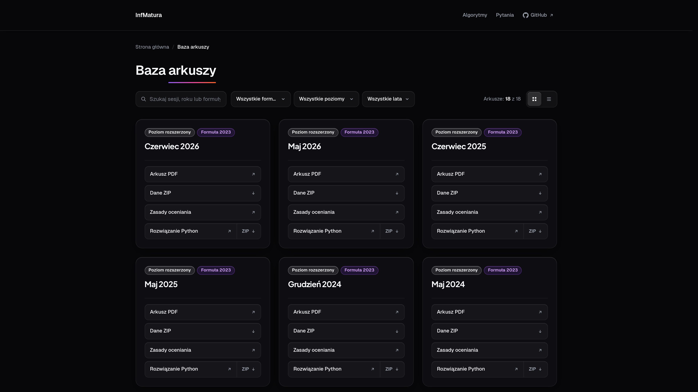
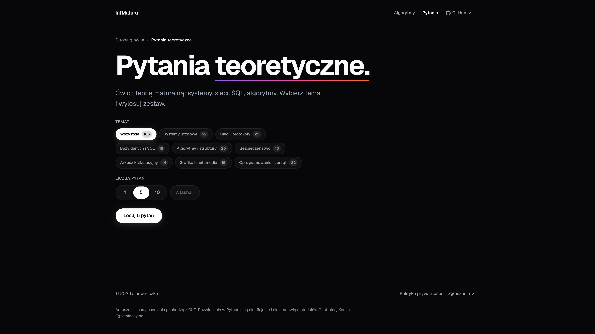
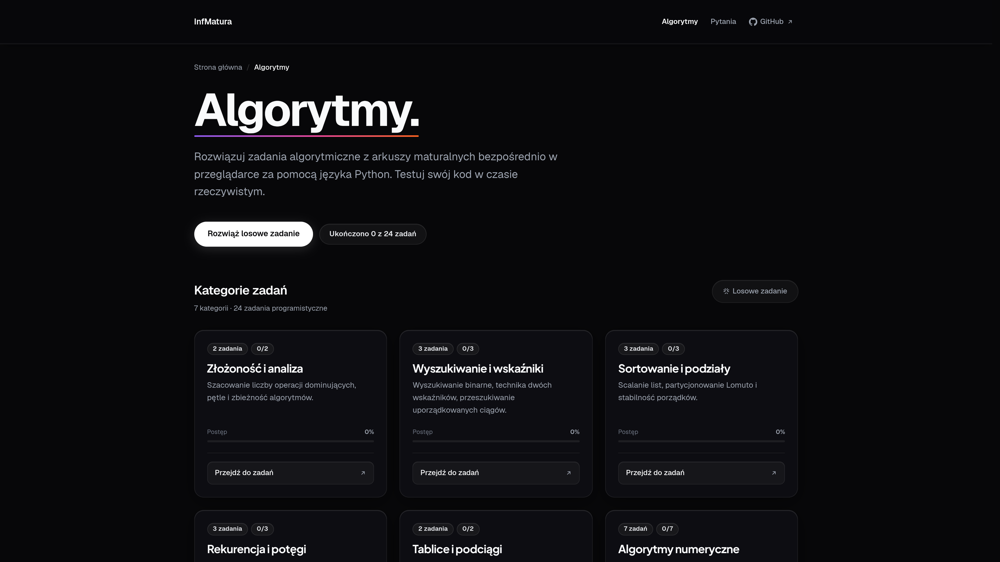
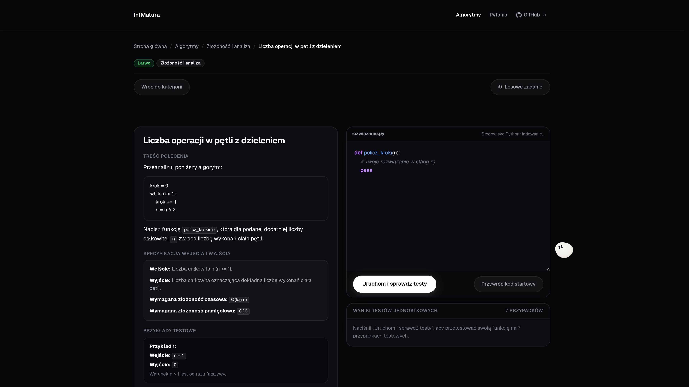

# InfMatura

Wyszukiwarka arkuszy maturalnych z informatyki rozszerzonej z podgladem rozwiązan i testami z pytań teoretycznych.

**[infmatura.dev](https://infmatura.dev)**

---

## Funkcje

- Filtrowanie arkuszy CKE po roku, formule egzaminu i poziomie (rozszerzony / podstawowy)
- Wyszukiwanie po nazwie sesji
- Dedykowane podstrony arkuszy z podgladem kodu rozwiązan (Python, SQL, Markdown), kolorowaniem składni i przyciskiem kopiowania
- Testy z pytań teoretycznych z losowym wyborem i natychmiastową weryfikacją odpowiedzi
- Bezpośredni dostęp do arkuszy PDF, plików z danymi (ZIP) i zasad oceniania CKE
- Interaktywna platforma algorytmiczna do pisania kodu w Pythonie bezpośrednio w przeglądarce, z automatyczną weryfikacją zadań i zapisem postępów

## Zrzuty ekranu

<div align="center">
  
  
  <br>
  
  
</div>

## Technologie

<br>

[](https://skillicons.dev)

**HTML5, CSS3, TypeScript** bez frameworków, zbudowane przez **Vite** i hostowane na **GitHub Pages**. Kolorowanie składni kodu przez **Prism.js**, renderowanie Markdown przez **Marked.js**, pliki z repozytorium danych serwowane przez **jsDelivr CDN**. Podstrony generowane skryptem **PowerShell** (`scripts/generate.ps1`).


## Dane i rozwiązania

Arkusze PDF, pliki z danymi, zasady oceniania oraz kod źródłowy rozwiązań w Pythonie znajdują się w osobnym repozytorium:

**[alanwnuczko/matura-informatyka-rozszerzona](https://github.com/alanwnuczko/matura-informatyka-rozszerzona)**

Podstrony arkuszy generowane są skryptem PowerShell (`scripts/generate.ps1`), który pobiera kod rozwiązań bezpośrednio z tego repozytorium i renderuje go ze statycznym kolorowaniem składni.

## Uruchomienie lokalne

```bash
git clone https://github.com/alanwnuczko/InfMatura.git
cd InfMatura
npm install
npm run dev
```

Strona będzie dostępna pod adresem wskazanym przez Vite (domyślnie `http://localhost:5173`).

Pozostałe polecenia:

```bash
npm run build     # produkcyjny build do dist/
npm run preview   # podgląd builda produkcyjnego
npm run typecheck # sprawdzenie typów TypeScript (tsc --noEmit)
```

## Licencja

[MIT](LICENSE)
